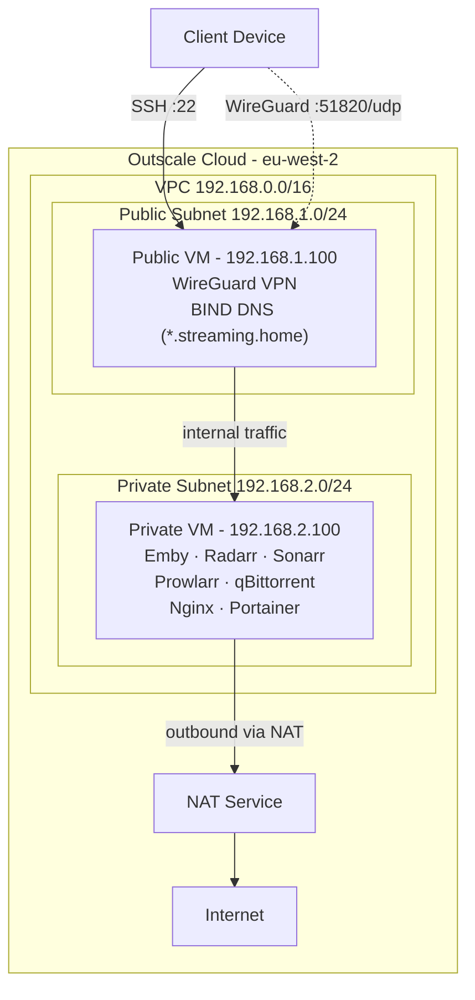

# Video Streaming Platform

Self-hosted media server deployed on [Outscale cloud](https://en.outscale.com/) with a two-tier network architecture. A WireGuard VPN provides secure remote access to all services from anywhere.

## Architecture



**Public VM** — gateway with WireGuard VPN + internal DNS server. Only machine reachable from the internet (SSH + WireGuard ports).

**Private VM** — runs the entire media stack. No public IP. Accessible only through the VPN tunnel or from the public VM. Uses NAT for outbound internet (downloading torrents, fetching metadata).

## What's Deployed

### Infrastructure (Terraform — `deploy/`)

| Resource | Detail |
|---|---|
| VPC | `192.168.0.0/16` with internet gateway |
| Public subnet | `192.168.1.0/24` — routed to internet gateway |
| Private subnet | `192.168.2.0/24` — routed through NAT |
| NAT service | Allows private subnet to reach internet |
| Public VM | `t2.large`, RockyLinux 9, public IP attached |
| Private VM | `m3.xlarge`, RockyLinux 9, 500 GB disk, no public IP |
| Security groups | Public: SSH (22) + WireGuard (51820). Private: all traffic from public SG only |

### Services (Docker)

| Service | Port | VM | Description |
|---|---|---|---|
| **WireGuard** | 51820/udp | Public | VPN server, 10 peers |
| **BIND DNS** | 53 | Public | Resolves `*.streaming.home` to private VM |
| **Emby** | 8096 | Private | Media server |
| **qBittorrent** | 8080 | Private | Torrent client |
| **Radarr** | 7878 | Private | Movie management |
| **Sonarr** | 8989 | Private | TV show management |
| **Prowlarr** | 9696 | Private | Indexer manager for Radarr/Sonarr |
| **Nginx** | 80/443 | Private | Reverse proxy with SSL (`streaming.home`) |
| **Portainer** | 9000 | Private | Docker management UI |

## Prerequisites

- [Outscale](https://en.outscale.com/) account with API access keys
- [Terraform](https://www.terraform.io/downloads.html) installed
- SSH key pair registered in Outscale (`outscale_main_keypair_eu`)
- [WireGuard client](https://www.wireguard.com/install/) on your device

## Deploy the Infrastructure

```bash
cd deploy

# Create terraform.tfvars with your credentials
cat > terraform.tfvars <<EOF
access_key_id = "your-access-key"
secret_key_id = "your-secret-key"
EOF

terraform init
terraform plan
terraform apply
```

Terraform outputs the public VM IP:

```bash
terraform output vm_public_ip
```

## Connect via VPN

1. SSH into the public VM:

   ```bash
   ssh -i ~/.ssh/your_key outscale@$(terraform output -raw vm_public_ip)
   ```

2. Grab a peer config:

   ```bash
   sudo cat /opt/video_streaming/config/peer1/peer1.conf
   ```

3. Import the config into the WireGuard app on your device

4. Once connected, access services at `streaming.home`:
   - `https://streaming.home` — Nginx landing page
   - `https://streaming.home:8096` — Emby
   - `https://streaming.home:8080` — qBittorrent
   - `https://streaming.home:7878` — Radarr
   - `https://streaming.home:8989` — Sonarr

## Project Structure

```
video_streaming/
├── deploy/                           # Terraform infrastructure
│   ├── config.tf                     # Outscale provider configuration
│   ├── net.tf                        # VPC, subnets, NAT, route tables
│   ├── security_groups.tf            # Security groups and rules
│   ├── vms.tf                        # Public + private VM definitions
│   ├── variables.tf                  # Input variables
│   ├── output.tf                     # Outputs (public IP, private IP)
│   └── resources/
│       ├── init_vm_public.sh         # Public VM startup (Docker + WireGuard + DNS)
│       └── init_vm_private.sh        # Private VM startup (Docker + media stack)
├── docker-compose.wireguard.yml      # WireGuard container (runs on public VM)
├── docker-compose.apparr.yml        # Media stack containers (runs on private VM)
├── resources/
│   ├── nginx.conf                    # Nginx reverse proxy config
│   ├── setup_ca.sh                   # Root CA certificate generation
│   ├── setup_cert.sh                 # Site SSL certificate generation
│   ├── named                         # BIND named config
│   ├── zones.streaming.home          # DNS zone definitions
│   ├── db.*                          # DNS zone files
│   ├── resolver_*.conf               # DNS resolver configs
│   └── ...
├── .gitignore
└── README.md
```

## How It Works

1. Terraform creates the VPC, subnets, and VMs on Outscale
2. **Public VM startup script** installs Docker, clones this repo, starts WireGuard container, and configures BIND DNS with `streaming.home` zone
3. **Private VM startup script** installs Docker, clones this repo, starts the media stack, and points DNS resolution to the public VM's BIND server
4. You connect your device via WireGuard — DNS resolves `streaming.home` to the private VM, and Nginx serves all apps behind SSL
